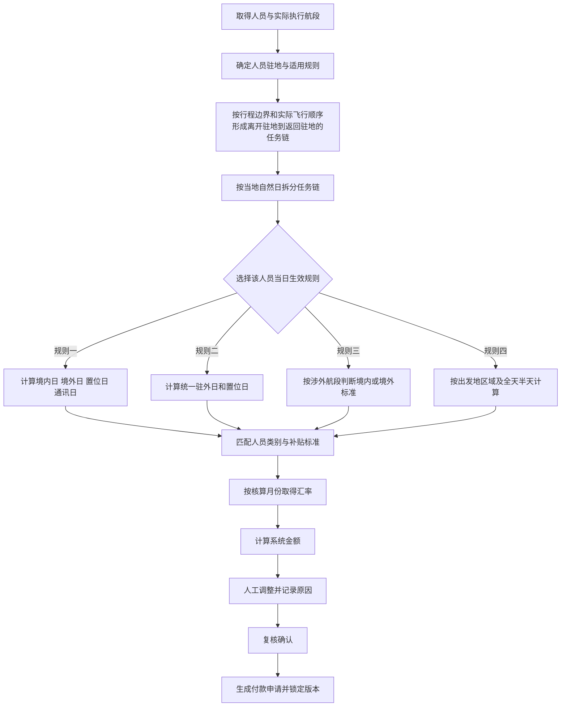

# 驻外补贴判断逻辑确认稿

## 1 文档目的

本文用于确认 Starjet SOC 驻外补贴模块应采用的业务判断逻辑，并对照当前原型页面说明已经实现、仅作展示以及仍需确认的内容。

依据包括：

- 《驻外补贴-规则 新系统（初稿）》中的驻外补贴规则一至规则四。
- 当前“驻外补贴规则”和“驻外补贴管理”页面的配置项、示例数据及交互逻辑。

截至 2026 年 9 月 25 日，当前页面仍是前端演示原型。补贴天数、系统金额和适用规则均来自预置示例数据，并未根据航班、人员驻地和规则配置实时计算。因此，本文中的“目标判断逻辑”不能视为已完成的系统能力。

## 2 当前结论

业务已经确认大部分核心口径，可以据此继续细化数据模型、计算引擎和验收用例。已确认的关键结论包括：

第 10 节现有 21 项判断中，14 项已确认、4 项部分确认、3 项待确认。

1. 补贴规则按人员配置，不使用全局唯一规则。
2. 香港、澳门、台湾按境外计算；所有规则均另行发放境外通讯补贴。
3. 同一人员同一自然日的通讯补贴最多计 1 天，置位涉及境外时也发放。
4. 实际关车时间恰好为 02:00 时，凌晨归站豁免结果为 0 天。
5. 规则四按当日第一个航段的出发地取区域；无航班的中间日按前一航段出发地取区域；置位不参与全天、半天判断。
6. 时间判断使用机场当地时间；航班或人员数据变更后保留旧版本并生成新版本重新复核。
7. 人工调整额以人民币录入，在系统原币金额折算成人民币后加减。

仍需业务补充的内容主要是：规则一同一自然日存在多个航段时的境内外合并口径、置位天数的境内外属性、实际关车时间缺失时的替代数据、跨月汇率、付款后更正流程，以及规则二、规则三是否也使用 02:00 归站豁免。详细状态见第 10 节。

## 3 关键术语与基础数据

### 3.1 人员范围

适用人员类别：

- 飞行员
- 乘务员
- 机务
- 其他空勤或随行人员

每名人员至少需要维护以下基础数据：

- 姓名和人员唯一编号
- 机组类别与航班职责
- 驻地城市
- 适用补贴规则
- 适用补贴标准
- 标准币种
- 规则和标准的生效日期、失效日期

补贴规则必须关联到具体人员，并支持按生效日期保留历史版本。同一航班上的不同人员可以适用不同规则。

### 3.2 航班与任务数据

计算至少依赖：

- 航班或任务唯一编号
- 航段顺序
- 航班日期
- 起飞机场和落地机场
- 实际起飞机场和实际最终落地机场，包括备降、返航后的实际结果
- 起飞、落地城市与国家或地区
- 计划起飞时间
- 实际落地时间
- 实际关车时间
- 航段当地时区
- 任务类型，包括载客、调机、置位、本场、学员带飞和试车等
- 实际执行人员

### 3.3 地域口径

当前需求存在两套不同口径，系统中必须分别维护，不能混用：

1. **境内外口径**：规则一和规则三使用。需求原文说明，中国大陆以外均属于境外，因此香港、澳门、台湾按境外处理。
2. **A B C 区域口径**：规则四使用。
   - A 区域：欧洲、日本。
   - B 区域：中国大陆、香港、澳门、台湾。
   - C 区域：除 A、B 区域外的其他国家和地区。

### 3.4 时间口径

- 规则一的归站截止时间默认是驻地当地时间 02:00，并允许配置。
- 规则四的全天半天分界默认是当地时间 12:00。
- 离开驻地使用计划起飞时间减去航前提前量，默认提前 3 小时。
- 返回驻地使用实际关车时间加上航后延后量，默认延后 1 小时。
- 所有判断应先转换为对应机场或人员驻地的当地时间，不能直接使用 UTC 字符串比较。

## 4 总体计算流程



建议正式系统以“人员 + 自然日”为基础核算单位，再汇总到任务、航班、人员和月份。一个自然日内存在多个航段时，应先合并判断，避免同一人员同一天重复领取日补贴或通讯补贴。

## 5 规则一 境内外分段规则

### 5.1 适用逻辑

- 驻外补贴按实际驻外天数和置位天数核算。
- 境内驻外、境外驻外分别匹配不同标准。
- 航班涉及境外城市时，另行计算境外通讯补贴。
- 当天离开驻地并返回驻地，原则上不计驻外补贴；但实际关车时间超过归站截止节点时，按 1 天计。

### 5.2 驻外任务链

建议按人员建立任务链：

1. 人员从其驻地城市执行第一个离站航段时，任务链开始。
2. 人员连续执行航班或置位，尚未回到驻地时，任务链持续。
3. 人员执行航段落地驻地城市时，任务链结束。
4. 同一人员存在多个不连续任务链时，分别计算后再汇总。

### 5.3 同日或次日凌晨返回驻地

需求原文给出的默认阈值是 02:00，业务已确认边界值按以下方式处理：

- 实际关车时间早于或等于 02:00：返回日不计驻外补贴。
- 实际关车时间晚于 02:00：返回日按 1 天计驻外补贴。

原文示例：

- 9 月 1 日离开上海驻地，9 月 2 日 02:01 在上海实际关车，驻外天数为 1 天。
- 9 月 1 日离开上海驻地，9 月 2 日 01:01 在上海实际关车，驻外天数为 0 天。

这里的“当天往返”实际可能跨越自然日，业务已确认按单个行程形成的单任务链判断。本文统一命名为“单任务链归站豁免”，不要求必须在同一日历日往返。

### 5.4 普通跨日驻外

原文说明：9 月 1 日离开上海驻地，9 月 2 日返回上海驻地，驻外天数为 2 天。

因此在不适用凌晨归站豁免时，离站日和归站日均计入驻外天数，中间完整自然日也计入。

### 5.5 境内日与境外日

业务已确认：

1. “最终落地城市”是指每一个航段实际执行后的最终落地城市，不是整个行程的最终目的地，也不能只使用计划落地机场。
2. 航段发生备降、返航或落地机场变更时，以实际最终落地城市重新判断。
3. 中国大陆以外均按境外处理，香港、澳门、台湾属于境外。
4. 示例 A“上海—沈阳—香港、香港—深圳、深圳—上海”的结果为境外 2 天、境内 1 天、通讯补贴 2 天。

目前仍缺少“同一自然日多个航段”的唯一合并公式。例如，同一天先落地境内、再落地境外，或从境外起飞后落地境内时，应按最后落地、任一涉外还是其他顺序规则确定该日属性。示例 A 已确认结果，但还不足以覆盖所有组合。正式开发前需要补充一条可直接执行的逐日合并规则，避免实现人员自行推断。

### 5.6 置位

业务已确认，置位由机组排班配置，表示机组提前到达机场等待客户的天数。原文公式区分“境内置位天数”和“境外置位天数”，因此正式数据模型仍应分别记录：

- 境内置位天数
- 境外置位天数

当前原型只有一个 `positioningDays` 字段，无法正确套用规则一的两个公式。业务尚未明确置位天数的境内外属性，仍需从以下方式中确定一种：

- 按置位航段最终落地城市判断。
- 按置位航段是否涉及境外判断。
- 按置位结束后的驻留地点判断。

### 5.7 通讯补贴

通讯补贴适用于规则一至规则四，并按“人员 + 当地自然日”去重：

- 当天任一航段涉及境外城市，通讯补贴天数加 1。
- 同一天执行多个境外航段，仍只计 1 天通讯补贴。
- 当天往返境外且不产生驻外补贴时，仍计 1 天通讯补贴。
- 仅置位涉及境外时，也计 1 天通讯补贴。

### 5.8 计算公式

```text
境内驻外补贴 = （境内驻外天数 + 境内置位天数）× 境内日标准

境外驻外补贴 = （境外驻外天数 + 境外置位天数）× 境外日标准
               + 境外通讯补贴天数 × 通讯补贴日标准

系统金额 = 境内驻外补贴 + 境外驻外补贴
```

如果境内与境外标准使用不同币种，应分别折算成人民币后相加，不能先把不同币种的原币金额直接相加。

## 6 规则二 统一日标准

### 6.1 判断逻辑

- 不区分境内、境外或 A/B/C 区域。
- 驻外天数与置位天数均按统一日标准计算。
- 仍需要使用人员驻地判断何时离开驻地、何时返回驻地。
- 归站截止节点是否继续适用，原文未明确。当前配置页面将其作为公共参数，等同于默认适用，需要业务确认。

### 6.2 计算公式

```text
系统金额 = （驻外天数 + 置位天数）× 统一补贴日标准
         + 境外通讯补贴天数 × 通讯补贴日标准
```

规则二涉及境外航段或境外置位时，仍按第 5.7 节另行计算通讯补贴，不视为已经包含在统一日标准中。

## 7 规则三 涉外航段规则

### 7.1 判断逻辑

- 驻外补贴按天计算。
- 航段的起飞机场或落地机场任一属于境外时，该核算日采用境外标准。
- 未涉及境外时采用境内标准。
- 驻外天数与置位天数均计入补贴。

### 7.2 多航段合并建议

建议先按“人员 + 自然日”合并全部执行航段：

- 当天任一航段涉及境外，整日按境外标准。
- 当天所有航段均为中国大陆境内，整日按境内标准。
- 同一天不同时产生一个境内日和一个境外日。

此规则与规则一的“最终落地城市判定”不同，系统实现时不能共用同一个境内外判断函数。

### 7.3 计算公式

```text
境内系统金额 = （境内驻外天数 + 境内置位天数）× 境内日标准

境外系统金额 = （境外驻外天数 + 境外置位天数）× 境外日标准
               + 境外通讯补贴天数 × 通讯补贴日标准
```

规则三涉及境外航段或境外置位时，仍按第 5.7 节另行计算通讯补贴。

## 8 规则四 区域全天半天规则

### 8.1 区域判断

每日外站津贴按出发地所属区域计算：

- A 区域：欧洲、日本。
- B 区域：中国大陆、香港、澳门、台湾。
- C 区域：其他国家和地区。

原文示例：7 月 5 日从北京前往洛杉矶，当日按北京所属 B 区域标准计算。

业务已确认，每个自然日只取当天第一个实际执行航段的起飞机场作为“每日出发地”，同一天后续航段不再重复计算日补贴。

### 8.2 离开驻地当天

先计算：

```text
航前判定时间 = 计划起飞当地时间 - 航前提前量
```

默认航前提前量为 3 小时：

- 航前判定时间早于或等于 12:00：按全天计算。
- 航前判定时间晚于 12:00：按半天计算。

### 8.3 返回驻地当天

先计算：

```text
航后判定时间 = 实际关车当地时间 + 航后延后量
```

默认航后延后量为 1 小时：

- 航后判定时间晚于 12:00：按全天计算。
- 航后判定时间早于或等于 12:00：按半天计算。

### 8.4 中间驻外日

离开驻地日和返回驻地日之间的完整自然日均按全天计算，并按该日第一个实际执行航段的出发地区域匹配标准。

中间某日没有执行航班时，业务已确认按前一航段的出发地所属区域匹配标准。

### 8.5 计算公式

```text
系统金额 = Σ（各区域全天数 × 对应区域全天标准）
         + Σ（各区域半天数 × 对应区域半天标准）
         + 境外通讯补贴天数 × 通讯补贴日标准
```

规则四涉及境外航段或境外置位时，仍按第 5.7 节另计通讯补贴。置位不作为执行航段参与规则四的全天、半天和区域日补贴判断。

## 9 金额 汇率 调整与状态

### 9.1 标准匹配顺序

建议按以下维度匹配唯一标准：

1. 核算日期处于标准有效期内。
2. 匹配生效规则。
3. 匹配人员类别。
4. 匹配境内外、统一或 A/B/C 区域。
5. 匹配人员或合同的特殊标准；没有特殊标准时使用类别默认标准。

匹配不到标准或同时匹配多个标准时，不应自动生成确定金额，应标记为“计算异常，待处理”。

### 9.2 汇率

- 人民币金额的汇率固定为 1。
- 外币按核算月份匹配“外币兑人民币”汇率。
- 当前需求说明汇率由财务每月手动维护。
- 缺少当月汇率时不得沿用不明确的历史汇率，应进入异常状态。
- 跨月任务按补贴归属日汇率还是任务结束月汇率，业务尚未确认。

### 9.3 人工调整

业务已确认人工调整额以人民币录入，目标计算顺序为：

```text
系统折合人民币金额 = 系统原币金额 × 当月汇率
人民币应发金额 = 系统折合人民币金额 + 人民币人工调整额
```

人工调整额是否允许为负数仍需结合补发、扣回和冲销流程确定。

正式系统应强制记录：

- 调整前金额
- 调整额
- 调整币种
- 调整原因
- 调整人
- 调整时间
- 复核人

### 9.4 建议状态流转

```text
待计算 → 待复核 → 已确认 → 已生成付款申请 → 已支付
              ↘ 计算异常
              ↘ 有调整待复核
```

- 航班或人员数据变化后，应保留旧计算版本并将其标记为已失效，同时生成新版本重新计算并进入待复核，不覆盖历史数据。
- 已生成付款申请后，补贴明细应锁定；如需修改，应走撤回或冲销流程。
- 当前原型只有“待复核、已确认、有调整”三种展示状态，且没有审批、锁定和付款闭环。

## 10 业务确认结果与剩余事项

状态说明：**已确认**可直接进入详细设计；**部分确认**已有业务方向，但仍缺少可执行的边界定义；**待确认**暂不应固化到计算引擎。

| 编号 | 判断项 | 状态 | 业务结论与落地要求 |
| --- | --- | --- | --- |
| C01 | 规则一境内外日判定 | 部分确认 | 按每个航段实际最终落地城市判断，备降、返航或落地变更后不得沿用计划目的地。仍需补充同一自然日多个航段的日属性合并规则。 |
| C02 | 示例 A | 部分确认 | 已确认结果为境外 2 天、境内 1 天、通讯 2 天，香港按境外。仍需说明第二天“香港—深圳”计境外日所采用的通用判断条件，以便覆盖其他相似航线。 |
| C03 | 02:00 边界 | 已确认 | 实际关车时间恰好 02:00 时计 0 天；晚于 02:00 才计 1 天。 |
| C04 | 凌晨归站豁免范围 | 已确认 | 以一个行程形成的单任务链为判断范围，不以是否跨自然日作为限制。 |
| C05 | 规则生效范围 | 已确认 | 规则按人员配置；人员规则需要生效日期和版本，同一航班不同人员可以采用不同规则。 |
| C06 | 置位境内外属性 | 部分确认 | 已确认置位在机组排班中配置，表示机组提前到机场等待客户的天数；尚需确认该天数按置位目的地、涉及境外或实际驻留地划分境内外。 |
| C07 | 境外通讯补贴去重 | 已确认 | 同一人员同一当地自然日最多计 1 天，不考虑境外航段数量。 |
| C08 | 仅置位涉及境外 | 已确认 | 置位涉及境外时发放通讯补贴。 |
| C09 | 规则二通讯补贴 | 已确认 | 所有规则均另行发放境外通讯补贴。 |
| C10 | 规则三通讯补贴 | 已确认 | 所有规则均另行发放境外通讯补贴。 |
| C11 | 规则四通讯补贴 | 已确认 | 所有规则均另行发放境外通讯补贴。 |
| C12 | 规则四每日出发地 | 已确认 | 取当日第一个实际执行航段的出发地。 |
| C13 | 规则四无航班中间日 | 已确认 | 按前一航段的出发地所属区域计算。 |
| C14 | 规则四置位 | 已确认 | 置位不参与规则四全天、半天和区域日补贴判断，但置位涉及境外时仍发通讯补贴。 |
| C15 | 时间数据源 | 部分确认 | 实际关车时间将由航班计划详情提供；仍需定义关车时间为空、延迟回填或更正时的异常与重算处理。 |
| C16 | 跨时区 | 已确认 | 使用相关机场所在地的当地时间判断，底层应使用统一机场时区库转换。 |
| C17 | 跨月汇率 | 待确认 | 补贴汇率口径待定，需明确按补贴归属日、任务结束月还是付款月取值。 |
| C18 | 人工调整币种 | 已确认 | 人工调整额统一使用人民币，在系统金额折算成人民币后加减。 |
| C19 | 数据变化重算 | 已确认 | 保留旧版本并标记失效，生成新版本重新计算和复核，不覆盖历史记录。 |
| C20 | 付款后更正 | 待确认 | 后续补充撤回、补发、扣回和冲销流程；在确认前，已付款记录默认不可直接修改。 |
| C21 | 规则二、规则三归站豁免 | 待确认 | 当前配置将 02:00 归站截止作为公共参数，但原始文字主要出现在规则一。需明确规则二、规则三是否采用相同的单任务链归站豁免。 |

## 11 建议验收用例

以下已确认用例应转为自动化测试；涉及“部分确认”或“待确认”口径的用例，先作为业务评审用例保留，不应自行补齐预期结果。

| 用例 | 输入 | 预期结果 |
| --- | --- | --- |
| T01 | 上海驻地，9 月 1 日离站，9 月 2 日 01:01 在上海关车 | 规则一驻外 0 天 |
| T02 | 上海驻地，9 月 1 日离站，9 月 2 日 02:01 在上海关车 | 规则一驻外 1 天 |
| T03 | 上海驻地，关车时间恰好 02:00 | 规则一驻外 0 天 |
| T04 | 当天上海-香港-上海 | 驻外 0 天，通讯补贴 1 天 |
| T05 | 同一人员同一天执行两个境外航段 | 通讯补贴只计 1 天，避免重复 |
| T06 | 上海—沈阳—香港、香港—深圳、深圳—上海三天任务链 | 境外 2 天、境内 1 天、通讯补贴 2 天；逐日合并算法在 C01、C02 完成后固化 |
| T07 | 原文示例 B 两天任务链 | 境内 2 天，通讯补贴 1 天 |
| T08 | 规则二驻外 2 天、置位 1 天 | 3 × 统一日标准 |
| T09 | 规则三当天任一航段涉及境外 | 整日按境外标准 |
| T10 | 规则四计划起飞 15:00，航前提前 3 小时 | 判定时间 12:00，离站日按全天 |
| T11 | 规则四计划起飞 15:01，航前提前 3 小时 | 判定时间 12:01，离站日按半天 |
| T12 | 规则四实际关车 11:00，航后延后 1 小时 | 判定时间 12:00，归站日按半天 |
| T13 | 规则四实际关车 11:01，航后延后 1 小时 | 判定时间 12:01，归站日按全天 |
| T14 | 外币系统金额 270 USD，人民币调整额 30 元，汇率 7.18 | 人民币应发 1,968.60 元，即 270 × 7.18 + 30 |
| T15 | 外币记录缺少当月汇率 | 进入计算异常，不生成付款申请 |
| T16 | 已确认后修改实际关车时间 | 旧版本保留，新版本重新计算并进入待复核 |
| T17 | 同一航班中人员 A 配置规则一、人员 B 配置规则四 | 两人分别按各自生效规则计算，互不覆盖 |
| T18 | 同一人员同一天执行 3 个境外航段 | 通讯补贴 1 天 |
| T19 | 人员仅通过置位到达境外机场等待客户 | 置位不参与规则四全天半天，但通讯补贴计 1 天 |
| T20 | 规则四中间驻外日没有航班 | 按前一航段出发地所属区域计算全天补贴 |
| T21 | 航段计划落地东京，实际备降上海 | 境内外属性按上海这一实际最终落地城市重新判断 |
| T22 | 实际关车时间先为空、后补录 | 待 C15 补充缺失数据处理规则后确定；补录触发重算时应遵循 C19 的版本规则 |

## 12 当前原型实际行为

### 12.1 已有能力

- 展示四套规则配置方案。
- 配置默认归站截止时间、全天半天分界、航前和航后偏移时间。
- 配置是否包含置位和是否启用通讯补贴。
- 增删人员类别与区域对应的补贴标准。
- 维护 A/B/C 区域、驻地城市和月度汇率。
- 按日期、机组类别、注册号、姓名、航班和核算状态筛选示例记录。
- 按航班展开人员补贴明细。
- 输入人工调整额。
- 当前原型使用以下公式计算前端展示的人民币应发金额，该公式与已确认的人民币调整口径不一致：

```text
人民币应发金额 = （示例系统金额 + 人工调整额）× 示例汇率  // 当前原型，待修正
```

### 12.2 尚未实现

- 从真实航班和机组排班数据生成补贴记录。
- 按人员驻地形成连续任务链。
- 自动判断境内、境外和 A/B/C 区域。
- 自动计算驻外天数、置位天数和通讯补贴天数。
- 自动执行规则一至规则四的金额计算。
- 将规则配置应用到管理页面。
- 服务端保存、权限控制、规则版本和生效日期。
- 计算异常处理、复核审批、付款锁定和冲销。
- 导出真实明细和生成真实付款申请。

### 12.3 当前原型中需要修正的示例问题

1. 当前只有全局生效规则配置，应改为人员与规则版本的关联配置。
2. 规则一需要分别记录境内置位和境外置位，当前只有单一置位天数字段，且地域归属口径尚未确认。
3. 所有规则都应另行计算境外通讯补贴，当前配置与金额示例需要统一校验。
4. `systemAmount` 是直接写入的示例金额，不是由 `standard`、天数和汇率实时计算。
5. 人工调整目前先加到原币再换算，应改为系统金额折算人民币后再加人民币调整额。
6. 配置保存仅使用当前浏览器本地存储，不具备多用户共享、审计或正式生效能力。

## 13 后续处理顺序

1. 业务补充 C01、C02 的“人员 + 自然日”境内外合并公式，尤其是从境外起飞、落地境内以及同日多航段混合的情况。
2. 业务补充 C06 的置位境内外归属方式。
3. 业务补充 C15 的实际关车时间缺失、延迟回填和更正口径。
4. 财务确认 C17 的跨月汇率取值规则。
5. 财务和审批业务确认 C20 的付款后撤回、补发、扣回和冲销流程。
6. 业务确认 C21，明确规则二、规则三是否也使用 02:00 归站豁免。
7. 已确认的规则可以先进入详细设计，但未确认项必须以“待确认”或“计算异常”处理，不应由开发人员自行推断默认值。
8. 完成上述确认后，补齐第 11 节对应验收用例并由业务签字，再实施正式计算引擎。
